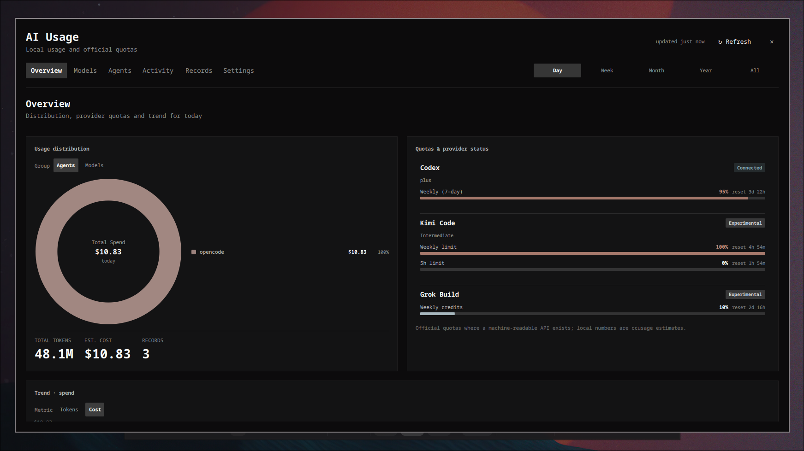
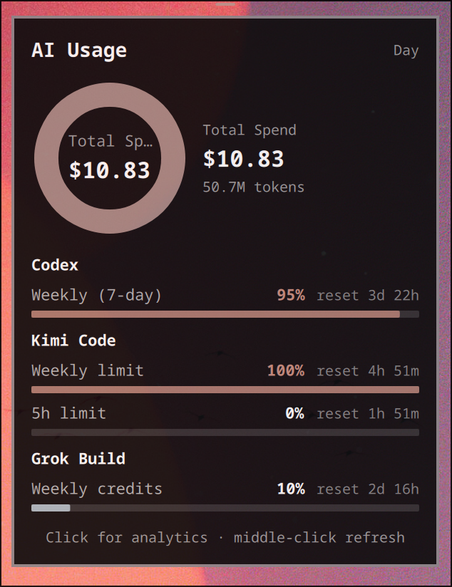
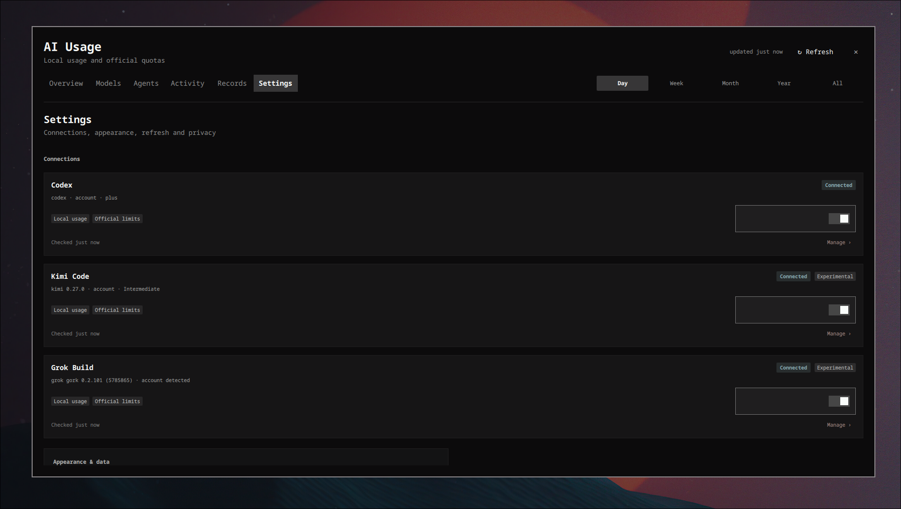

# AI Usage — quickshell plugin

Local AI coding usage, official provider quotas, hover summary and full
analytics overlay for the [Omarchy](https://github.com/omarchy) quickshell fork.

- **Bar widget** — icon, estimated cost, or token count for the selected range.
- **Hover popup** — compact donut, provider quota meters, quick totals.
- **Analytics overlay** (click) — Overview (donut + provider quotas + trend),
  Models, Agents, Activity (calendar heatmap), Records (sortable table),
  Settings (provider connections, appearance, refresh, privacy).

## Screenshots

| Analytics overlay (Overview) | Hover popup |
|---|---|
|  |  |



> Drop your screenshots into `docs/` with these exact names (see
> [docs/README.md](docs/README.md)).

## Provider integrations

| Provider | Official quota | How |
|---|---|---|
| **Codex** | rate-limit windows (primary/secondary) + plan | `codex app-server` JSON-RPC via the shared Omarchy scanner |
| **Kimi Code** | weekly limit + rolling windows (5h/7d/30d as the plan exposes them) + plan | the same `/usages` endpoint the CLI's `/usage` slash command uses |
| **Grok Build** | weekly/monthly credit pool + reset time | the same `billing?format=credits` endpoint the CLI's `/usage` fetches |

All other agents (Claude Code, Qwen Code, OpenCode, pi, …) appear through
**local history** parsed by [ccusage](https://github.com/ryoppippi/ccusage)
— tokens and estimated cost per model/agent/day, never presented as quota.

Kimi and Grok quota scripts speak the providers' OAuth flows directly:
expired tokens are refreshed through the official refresh endpoints and
written back atomically (under the CLI's own lock for Grok), so the CLI and
the plugin never invalidate each other's credentials.

## Requirements

- quickshell — **Omarchy fork**: the plugin uses the shared `qs.Commons` /
  `qs.Ui` QML modules and `Commons/scripts/codex_usage_scanner.py`
  (resolved as `../../Commons/scripts/` relative to the plugin). It does not
  run on vanilla quickshell.
- `python3` (standard library only — no pip packages)
- `ccusage` in `PATH` for local history
- `codex` / `kimi` / `grok` CLIs, only for the providers you enable

## Install

### Omarchy (upstream CLI)

```sh
omarchy plugin add https://github.com/dalmasluca/omarchy-ai-usage.git --enable
omarchy bar plugin add dalmasluca.ai-usage
# optional: bar display mode (icon | cost | tokens)
omarchy bar plugin set dalmasluca.ai-usage display cost
```

### Manual / other quickshell forks

```sh
git clone https://github.com/dalmasluca/omarchy-ai-usage.git
cp -r omarchy-ai-usage ~/.config/quickshell/plugins/ai-usage
```

Then enable the **AI Usage** bar widget from your shell's widget settings
(plugin id: `dalmasluca.ai-usage`).

> **Fork note:** if your `omarchy` CLI targets a different shell config than
> the running quickshell (e.g. it writes `~/.config/omarchy/shell.json` while
> your shell reads `~/.config/quickshell/shell-user.json`), use the manual
> install — the CLI would clone the plugin but not place it in your bar.

Codex monitoring is on by default; Kimi Code and Grok Build are opt-in from
the plugin's Settings → Connections.

Widget options (manifest defaults, editable per-widget):

- `display` — `icon` | `cost` | `tokens`
- `refreshMinutes` — polling interval (1–120, default 10)

## Privacy

- Local history is read via `ccusage`; tokens, keys and cookies are never
  printed in the UI or in logs.
- Provider CLIs are run only for detection/login status (existence checks).
- Official quotas use each provider's machine-readable surface with the
  **local OAuth tokens, held in memory only** — never printed, logged,
  cached on disk or stored anywhere else. Refreshed tokens are written back
  to the CLI's own credential file (atomic, `0600`).
- Network requests happen only for providers you enable.

## Theme

Charts use the theme's named `colors.toml` hues when present (exposed by the
shared `Color` singleton as `chart` / `positive`); themes without named
colors get an analogous palette derived from the accent hue.

## Credits

Derived from the AI Usage plugin shipped with the Omarchy quickshell fork
(MIT). Quota integrations for Kimi Code and Grok Build, provider detection
fixes and chart theming added on top.

## License

MIT — see [LICENSE](LICENSE).
